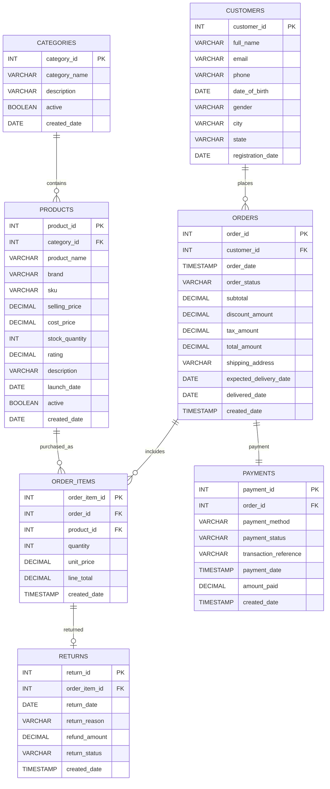

# Entity Relationship Diagram

```mermaid
erDiagram

    CUSTOMERS {
        INT customer_id PK
        VARCHAR full_name
        VARCHAR email
        VARCHAR phone
        DATE date_of_birth
        VARCHAR gender
        VARCHAR city
        VARCHAR state
        DATE registration_date
    }

    CATEGORIES {
        INT category_id PK
        VARCHAR category_name
        VARCHAR description
        BOOLEAN active
        DATE created_date
    }

    PRODUCTS {
        INT product_id PK
        INT category_id FK
        VARCHAR product_name
        VARCHAR brand
        VARCHAR sku
        DECIMAL selling_price
        DECIMAL cost_price
        INT stock_quantity
        DECIMAL rating
        VARCHAR description
        DATE launch_date
        BOOLEAN active
        DATE created_date
    }

    ORDERS {
        INT order_id PK
        INT customer_id FK
        TIMESTAMP order_date
        VARCHAR order_status
        DECIMAL subtotal
        DECIMAL discount_amount
        DECIMAL tax_amount
        DECIMAL total_amount
        VARCHAR shipping_address
        DATE expected_delivery_date
        DATE delivered_date
        TIMESTAMP created_date
    }

    ORDER_ITEMS {
        INT order_item_id PK
        INT order_id FK
        INT product_id FK
        INT quantity
        DECIMAL unit_price
        DECIMAL line_total
        TIMESTAMP created_date
    }

    PAYMENTS {
        INT payment_id PK
        INT order_id FK
        VARCHAR payment_method
        VARCHAR payment_status
        VARCHAR transaction_reference
        TIMESTAMP payment_date
        DECIMAL amount_paid
        TIMESTAMP created_date
    }

    RETURNS {
        INT return_id PK
        INT order_item_id FK
        DATE return_date
        VARCHAR return_reason
        DECIMAL refund_amount
        VARCHAR return_status
        TIMESTAMP created_date
    }

    CUSTOMERS ||--o{ ORDERS : places
    CATEGORIES ||--o{ PRODUCTS : contains
    ORDERS ||--o{ ORDER_ITEMS : includes
    PRODUCTS ||--o{ ORDER_ITEMS : purchased_as
    ORDERS ||--|| PAYMENTS : payment
    ORDER_ITEMS ||--o| RETURNS : returned
```